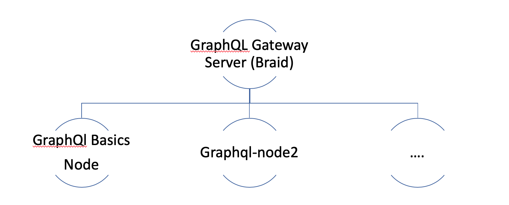

Handy guide to Develop GraphQL Services with GraphQL Gateway using Sprint Boot, Atlassian Braid and Spring JPA in java
======================================================================================================================

This demo includes
------------------

- How to use Spring Boot with GraphQL.
- How to build GraphQL service with microservices design patterns.
- How to build a GraphQL Gateway using Atlassian Braid in Java.
- GraphQL Java Integration.
- How to create multiple GraphQL nodes, stitch together using gateway (Graphql-Basics, graphql-node2).
- Sample maven build example to organize all graphql nodes and master gateway. 
- CRUD repository implementation using H2 Database.
- Spring JPA CRUD operation with GraphQL

Technology Stack
----------------

Spring Boot, Java, Maven, GraphQL Java, Atlassian Braid.

Datagraph Diagam
----------------

This demo contains 3 modules, a graphql-gateway to stitch both services together and 2 services (modules- Graphql-Basics, graphql-node2) as individual nodes. 
The GraphQL gateway expands horizontal to N number of nodes. 

Prerequisites 
-------------

Java 8+, Maven.

####Demo

Run the Demo locally
--------------------

    #checkout code
    git clone https://github.com/reethified/graphqlexamples.git
    #Build entire project
    mvn clean install

- Start basic service [Graphql-Basics node](graphqlbasics/README.md)
- Start node 2 [graphql-node2](graphql-node2/README.md)
- Start Gateway service [graphql-gateway](graphql-gateway/README.md)

Database configuration
-------

The Graphql-Basics node contains CRUD repository implementation using JPA over H2 Database. You can also connect to H2 DB UI to query tables:  http://localhost:8443/bms/h2
Refer to application property file for more details on h2 database.

####This demo also contains-
- How to use scalar like Date e.t.c

        SchemaClassScannerError: Unable to match type definition (TypeName{name='int'}) with java type (int): No TypeDefinition for type name int

References
----------

- [Atlassian Braid with GraphQL](https://bitbucket.org/atlassian/graphql-braid/src/master/)
- [Spring Boot](https://spring.io/projects/spring-boot)
- [GraphQL](https://graphql.org/)

